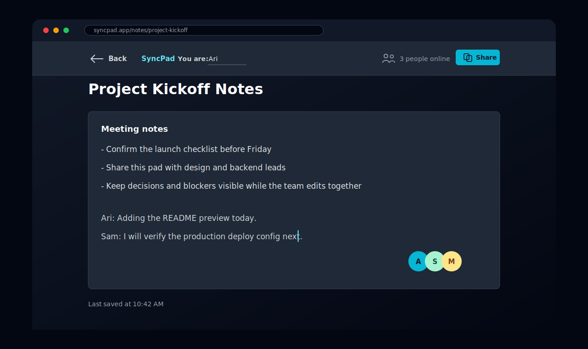

# SyncPad

SyncPad is a full-stack shared note workspace. Create a pad, share its URL, and edit with other people in real time.



## Features

- Live shared editing over Socket.IO
- Active user presence per pad
- Shareable pad URLs
- Auto-save to MongoDB
- Dark responsive interface
- No account required

## Tech Stack

Frontend:
- React 19
- Vite 7
- Tailwind CSS 4
- React Router
- Socket.IO Client
- Font Awesome

Backend:
- Node.js
- Express
- Socket.IO
- MongoDB with Mongoose
- CORS
- dotenv

## Getting Started

### Prerequisites

- Node.js 20.19 or newer
- npm
- A MongoDB connection string

### Install

```bash
npm install
npm --prefix client install
```

### Configure

Create a root `.env` file:

```bash
MONGODB_URI=your_mongodb_connection_string
PORT=5000
CLIENT_ORIGINS=http://localhost:3000
```

Create `client/.env`:

```bash
VITE_API_URL=http://localhost:5000
```

`CLIENT_ORIGINS` accepts a comma-separated list when you need to allow multiple frontend origins.

### Run Locally

Start the API and realtime server:

```bash
npm run dev
```

Start the client in another terminal:

```bash
npm run client
```

Open `http://localhost:3000`.

## Production

Build the client:

```bash
npm run build
```

Set `VITE_API_URL` to the deployed backend URL before building the frontend. Set `CLIENT_ORIGINS` on the backend to the deployed frontend origin.

## Project Structure

```text
syncpad/
|-- client/
|   |-- public/
|   |   `-- favicon.svg
|   |-- src/
|   |   |-- components/
|   |   |-- contexts/
|   |   |-- pages/
|   |   |-- App.jsx
|   |   |-- config.js
|   |   |-- index.css
|   |   `-- main.jsx
|   |-- index.html
|   |-- package.json
|   `-- vite.config.js
|-- package.json
|-- server.js
`-- vercel.json
```

## Verification

To verify realtime editing:

1. Open the same pad in two browser windows.
2. Change the username in each window.
3. Type in one window and confirm the other window updates.
4. Confirm the presence count changes as windows connect and disconnect.
